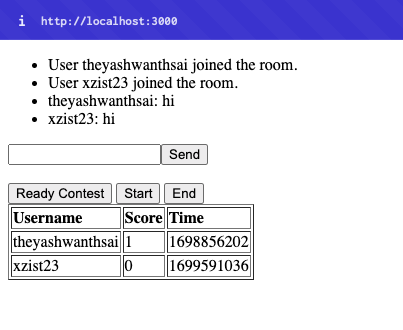

# leetArena
### Overview
LeetArena is a platform where users can create custom rooms, select LeetCode questions, and compete with their friends. This project is built using Node.js for the backend and HTML for the frontend, with Socket.IO facilitating real-time communication between users in the same room.

### Features
- Create and Join Rooms: Users can create custom rooms and share the room code with friends. They can also join existing rooms using the provided room code.
- Select LeetCode Questions: In each room, users can collaboratively select LeetCode questions they want to include in the contest.
- Real-time Chat: The platform features a real-time chat system using Socket.IO, allowing users in the same room to communicate seamlessly.
- Start Contests: Once users are ready, they can start a coding contest in the room, solving the selected LeetCode questions within a specified time frame.

### Technologies Used
- Node.js: Used for the backend server, handling room creation, user management, and real-time communication.
- Socket.IO: Facilitates bidirectional communication between the server and clients, enabling real-time updates and notifications.
- HTML/CSS/JavaScript: Frontend is built with HTML for structure, CSS for styling, and JavaScript for dynamic content and interaction.

# Todo
- [ ] Add timer
- [x] Refresh problem
- [x] custom problemset (soon)
- [ ] Tests
